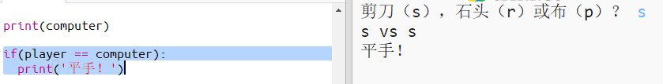
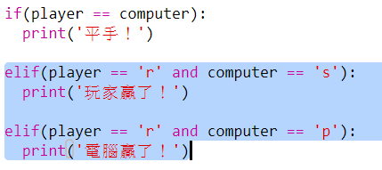
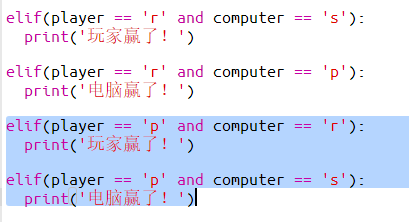
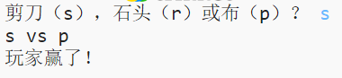

## 檢查結果

現在，讓我們來新增程式碼來決定誰贏了。

+ 你需要比較`player`和`computer`這兩個變數來決定誰贏了。
    
    如果它們相同，則是平手。
    
    

+ 重複你的遊戲，直到出現平手。
    
    你需要點選`Run`按鈕，開始新一輪遊戲。

+ 接下來，讓我們再來看看當玩家選擇了'r'（石頭），但電腦沒有選擇這個的情況。
    
    如果電腦選擇了's'（剪刀），那麼玩家就贏了（石頭勝出剪刀）。
    
    如果電腦選擇了'p'（布），那麼電腦就贏了（布勝石頭）。
    
    我們可以使用`and`來檢測玩家的選擇*和*電腦的選擇。
    
    

+ 接下來，讓我們再來看看當玩家選擇了'p'（布），但電腦沒有選擇布的情況。
    
    

+ 最後，你能不能試試新增程式碼來檢查當玩家選擇了's'（剪刀）但電腦選擇了石頭或布的情況下，如何決定誰贏了？

+ 現在執行這個遊戲來測試你的程式碼。
    
    
    
    點選`Run`來開始新一輪遊戲。