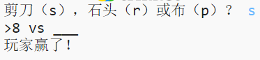
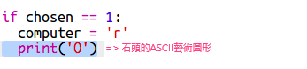
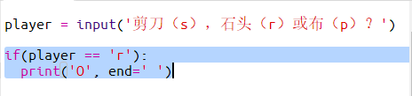

--- challenge ---

## 挑戰：ASCII 藝術圖形

你能使用ASCII碼影象替代字母r，p和s，來代表石頭，布和剪刀嗎？

例如：

其中：

    石頭：O
    布：___
    剪刀：>8
    

+ 在每個選項的`if`語句中，你需要新增一行新程式碼來顯示各個選項的ASCII 藝術圖形，並取代已有的`print computer`語句。 

提示：

+ 你需要新增一個新的if語句來檢查玩家的選擇並顯示相應的ASCII 藝術圖形，用以取代已有的`print player`語句。

提示：

記得在`print`中新增`end =' '`使它以空格結束而不是另起一行。

--- /challenge ---
