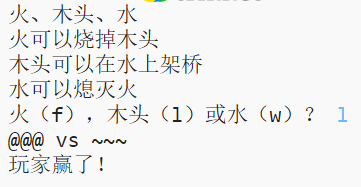

--- challenge ---

## 挑戰：建立一個新遊戲

你能建立一個類似於剪刀、石頭、布的新遊戲，但使用不同的物體嗎？

點選'Duplicate'按鈕來複制剪刀、石頭、布程式，並在此基礎上進行修改。

下面這個例子使用了火，木頭和水：

--- /challenge ---

***
該專案由以下志願者翻譯：

**Jude Chen**

**Xiongyiming Xiao**

正因為志願者們的辛勤工作，我們才能為世界各地的人們提供用母語來學習的機會。您也可以通過志願翻譯工作來幫助我們吸引更多的人 - 更多資訊，請訪問[rpf.io/translate](https://rpf.io/translate)。