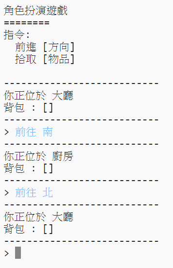
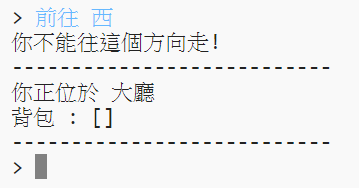
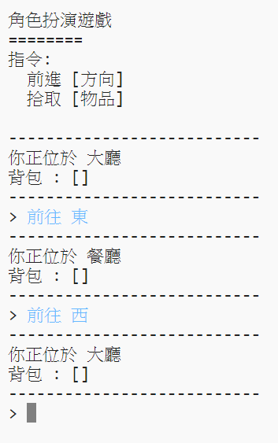

## 增加新房間

--- task ---

打開 Python

**線上**: 打開角色扮演專案的範例 [rpf.io/rpgon](https://trinket.io/python/cc347c52f0){:target="_blank"}。

**離線**: 下載角色扮演專案的範例 [starter project](resources/rpg.py){:target="_blank"} 並在電腦的 Python 編輯器打開。

--- /task ---

--- task ---

這個範例是非常簡單的角色扮演遊戲，裡面只包含兩個房間。這是這個遊戲的地圖：

你可以輸入 `前往 南` 來從大廳移動到餐廳，然後 `前往 北` 再次回到大廳！

--- /task ---

--- task ---

如果你輸入了不能前往的方向會怎樣呢？ 在大廳中輸入 `前往 西` 的話你會的到一個友善的錯誤提示訊息。

--- /task ---

--- task ---

找到變數 `rooms` , 你可以看到地圖被編寫成地圖的形式：

---
#一個房間連接關係的字典
rooms = {

            '大廳' : { 
                  '南' : '廚房'
                },

            '餐廳' : {
                  '北' : '大廳'
                }

        }
---

每一間房間是一個字典，並且用方位連接起每個房間。  

--- /task ---

--- task ---

讓我們來把餐廳加進地圖中，並把它加在大廳的東邊。

你需要加入第三個房間，取名為 `餐廳`, 並且將它跟大廳連結起來 (前往西邊)。你也需要把資料添加到大廳裡，如此一來當你往東邊移動就可以進入餐廳。

**別忘了在你新添加的程式碼前面將上註解**

---

#一個表示房間連接關係的字典
rooms = {

            '大廳' : { 
                  '南' : '廚房',
                  '東' : '餐廳'
                },

            '廚房' : {
                  '北' : '大廳'
                },
            '餐廳' : {
                  '西' : '大廳'
            }

        }
---

--- /task ---

--- task ---

試玩看看包含了餐廳的地圖:

如果你不能正常的進出餐廳，檢查看看你是不是正確的添加了上方的程式碼。

--- /task ---
