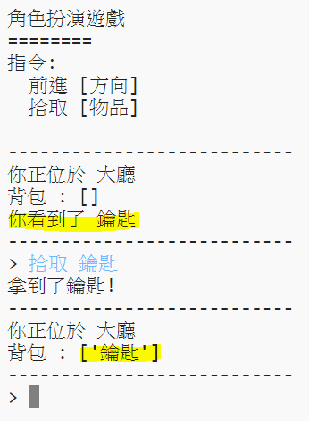

## 增加可以收集的物品

讓我們在房間中增加一些可以讓玩家收集的物品吧。

--- task ---

要在房間中增加物品是非常簡單的，你可以把物品加入房間的字典中。讓我們把鑰匙放在大廳裡！

要記得如果你要新增物品，必須要在前一個物品後加上逗號,要不然你的程式會無法執行！

---

#一個表示房間連接關係的字典
rooms = {

            '大廳' : { 
                  '南' : '廚房',
                  '東' : '餐廳',
                  '物品' : '鑰匙'
                },

            '廚房' : {
                  '北' : '大廳'
                },
            '餐廳' : {
                  '西' : '大廳'
            }

        }
---
--- /task ---

--- task ---

在你加入上方程式碼後執行程式，你可以看到大廳中有一把鑰匙，而且你可以把它撿起來 （輸入 `拾取 鑰匙`）就可以把物品放進你的背包中！

--- /task ---
