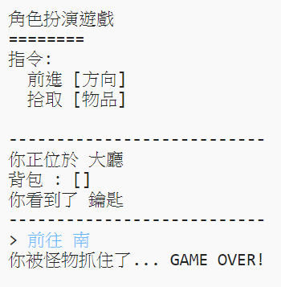

## 新增敵人

這個遊戲實在是太簡單了！ 讓我們在一些房間中增加敵人，讓玩家必須要躲避。

--- task ---

增加敵人到房間中就跟增加敵人一樣簡單。讓我們在廚房裡增加一些飢餓的野獸：

---

#一個表示房間連接關係的字典
rooms = {
            '大廳' : { 
                  '南' : '廚房',
                  '東' : '餐廳',
                  '物品' : '鑰匙'
                },

            '廚房' : {
                  '北' : '大廳',
                  '物品' : '怪物'
                },
            '餐廳' : {
                  '西' : '大廳'
            }

        }
---

--- /task ---

--- task ---

你會想要在玩家進入有怪物的房間後結束遊戲。下面的程式碼可以讓你完成這件事，讓我們把它加進程式碼的底部：

---
    #如果這間房間沒有玩家能撿的物品，則
    else:
      #告訴他們 你不能拿到這個物品!
      print('拿不到' + move[1] + '!')

  #如果玩家進入有怪物的房間就輸了
  if '物品' in rooms[currentRoom] and '怪物' in rooms[currentRoom]['物品']:
        print('你被怪物抓住了... GAME OVER!')
        break
---

這段程式碼檢查房間種是否有物品，如果有，再判斷它是不是怪物。注意這段程式碼的縮排位置，它比前段程式碼再前進一格，這表示每當玩家進入新的房間時，程式就會檢查一遍房間種有沒有怪物。

--- /task ---

--- task ---

進入有怪物的廚房來測試程式碼。

--- /task ---
