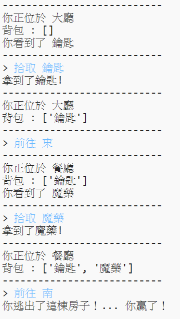
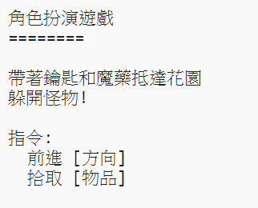

## 過關成功！

讓我們指派一個任務給玩家，完成這個任務就可以過關！

--- task ---

在這個遊戲中，玩家就由逃到花園中來取得勝利，同時他們背包中應該要有鑰匙和魔藥。這是一張遊戲的地圖：

--- /task ---

--- task ---

首先，你需要在寢室的南邊加上花園。記得新增連接到其他房間的房門。

---
#一個表示房間連接關係的字典
rooms = {

            '大廳' : { 
                  '南' : '廚房',
                  '東' : '餐廳',
                  '物品' : '鑰匙'
                },

            '廚房' : {
                  '北' : '大廳',
                  '物品' : '怪物'
                },
            '餐廳' : {
                  '西' : '大廳',
                  '南' : '花園'
            },
            '花園' : {
                  '北' : '餐廳',
            }
        }
        
---

--- /task ---

--- task ---

在餐廳中新增魔藥（或其他房間）。

---
            '餐廳' : {
                  '西' : '大廳',
                  '南' : '花園',
                  '物品' : '魔藥'
            },
---

--- /task ---

--- task ---

加入下方程式碼，讓玩家在進入花園且擁有鑰匙和魔藥時過關。

---
  #如果玩家進入有怪物的房間就輸了
  if '物品' in rooms[currentRoom] and '怪物' in rooms[currentRoom]['物品']:
    print('你被怪物抓住了... GAME OVER!')
    break
  #玩家在進入花園且擁有鑰匙和魔藥時過關
  if currentRoom == '花園' and '鑰匙' in inventory and '魔藥' in inventory:
    print('你逃出了這棟房子！... 你贏了！')
    break

---

確認這段程式碼和上一段一樣，往前縮排一格。這段程式碼代表 `你逃出了這棟房子！... 你贏了！` 會顯示出來如果玩家是在第四個房間 （花園）且背包中有鑰匙和魔藥。

--- /task ---

--- task ---

測試你的程式碼，確認玩家可以過關。

--- /task ---

--- task ---

最後，讓我們在遊戲中加入一些指示，讓玩家知道他們該做什麼。編輯 `showInstructions()` 還是來包含更多指示。
---
def showInstructions():
  #印出主選單和指令
  print('''
角色扮演遊戲
========

帶著鑰匙和魔藥抵達花園
躲開怪物!

指令:
  前進 [方向]
  拾取 [物品]
''')

---

你會需要加入指示，讓玩家知道他們應該收集什麼，和躲開什麼。

--- /task ---

--- task ---

測試你的遊戲，你應該看到新的指示。

--- /task ---
