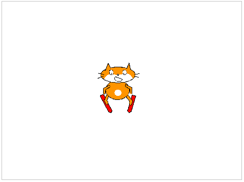
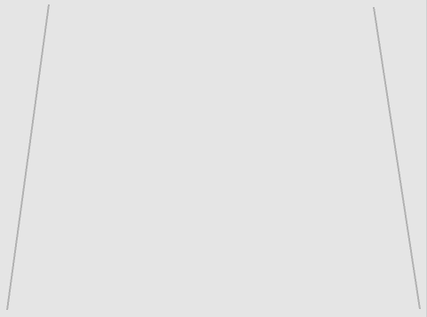
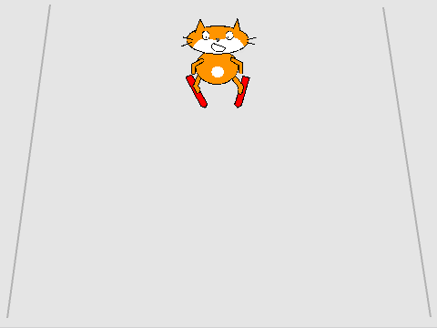

## Getting started

--- task ---

Open the Scratch starter project.

**Online**: open the starter project at [rpf.io/skiingon](http://rpf.io/skiingon){:target="_blank"}.

If you have a Scratch account you can make a copy by clicking **Remix**.

**Offline**: open the [starter project](http://rpf.io/p/en/scratch-cat-goes-skiing-go){:target="_blank"} in the offline editor.

If you need to download and install the Scratch offline editor, you can find it at [rpf.io/scratchoff](http://rpf.io/scratchoff){:target="_blank"}.

In the starter project, you should see a blank backdrop and a skier sprite.



--- /task ---

--- task ---

Paint a new backdrop for your ski slope: fill the background grey, and add some straight lines.



[[[generic-scratch3-paint-new-backdrop]]]

--- /task ---

--- task ---

Add code to your skiing cat sprite so that it appears at the top of the slope and faces downhill `when the flag is clicked`{:class="block3events"}.




```blocks3
when green flag clicked
go to x: (0) y: (100)
point in direction (90 v)
```

--- /task ---

--- task ---

Save and test your project.

[[[generic-scratch3-saving]]]

--- /task ---
