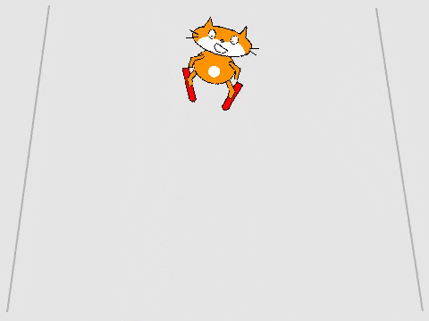

## Controlling the skier

You will use the left and right arrow keys to control the skier sprite, making it go left and right across the slope.



--- task ---

First, make the skier move and point to the left. Your code needs to:

1. Start `when the left arrow key is pressed`{:class="block3events"}
1. Change the angle the sprite is `pointed`{:class="block3motion"}
1. Move the sprite to the left by `changing x`{:class="block3motion"}


```blocks3
when [left arrow v] key pressed
point in direction (105 v)
change x by (-10)
```

--- /task ---

--- task ---

Use blocks similar to the ones above to make the sprite move to the right `when the right arrow key is pressed`{:class="block3events"}.

--- hints ---

--- hint ---

Add blocks to your code so `when the right arrow key is pressed`{:class="block3events"}, the sprite `points in the direction 75 degrees`{:class="block3motion"} before `changing the x position by 10`{:class="block3motion"}

--- /hint ---

--- hint ---

You will need these blocks:

```blocks3
    
point in direction (75 v)

when [right arrow v] key pressed

change x by (10)
```

--- /hint ---

--- hint ---

Your code should look like this:


```blocks3
when [right arrow v] key pressed
point in direction (75 v)
change x by (10)
```

--- /hint ---

--- /hints ---

--- /task ---

--- task ---

Test your program

--- /task ---