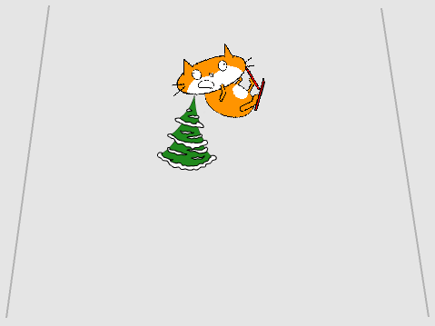

## Crashing

If the skier crashes into an obstacle, it should fall over and the game should end.



--- task ---

Change the code for the skier sprite to `wait until`{:class="block3control"} it is `touching`{:class="block3sensing"} the obstacle, and to then `stop all`{:class="block3control"}.


```blocks3
when green flag clicked
wait until <touching [Tree2 v] ?>
stop [all v]
```

--- /task ---

--- task ---

When the skier crashes, you should also `switch costume to fallenover`{:class="block3looks"}.

The updated code should look like this:


```blocks3
when green flag clicked
wait until <touching [Tree2 v] ?>
+ switch costume to (fallenover v)
stop [all v]
```

--- /task ---

--- task ---

Save and test your code. When the skier hits the obstacle, the costume should change and the game should stop. 

--- /task ---

However, there is a now problem with your game: the next time you run it, the skier will still be wearing the `fallenover`{:class="block3looks"} costume.

--- task ---

Edit the skier's so that their costume changes back to `skiing`{:class="block3looks"} when the game starts by `switching the costume to skiing`{:class="block3looks"}.


```blocks3
when green flag clicked
+ switch costume to (skiing v)
wait until <touching [Tree2 v] ?>
switch costume to (fallenover v)
stop [all v]
```

--- /task ---