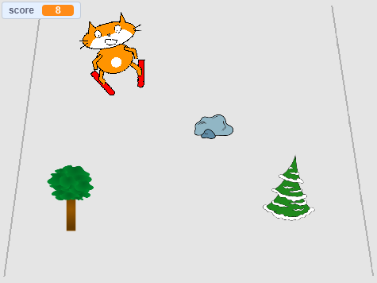

## Challenge: adding more obstacles

Add more sprites from the library as obstacles to make your game trickier!

When you add a new obstacle, you will need to think about:

1. Which sprite to use
1. What happens when the skier crashes into it
1. Whether to increase the score (and by how much) when the skier makes it past

If you need help, go back to the step in this project where you created the first obstacle.

