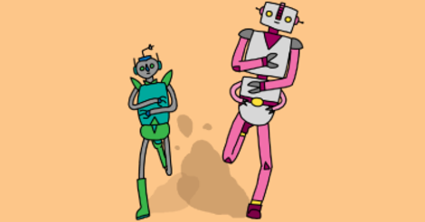

# Sprint

Find the project online at [projects.raspberrypi.org/en/projects/sprint-scratch2](https://projects.raspberrypi.org/en/projects/sprint)

## Resources
For project materials and solutions, see [en/resources](https://github.com/raspberrypilearning/sprint/tree/master/en/resources) and [en/solutions](https://github.com/raspberrypilearning/sprinT/tree/master/en/solutions).

## Contributing
See [CONTRIBUTING.md](CONTRIBUTING.md)

## Licence
 See [LICENSE.md](LICENSE.md)