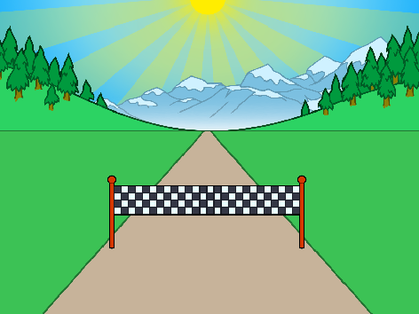
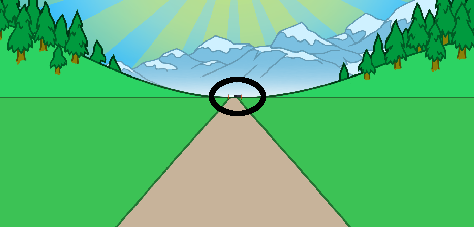

## On your marks...

Let's start by creating a race countdown.

--- task ---

Open the 'Sprint' Scratch starter project.

**Online**: open the [starter project](http://rpf.io/sprint-on){:target="_blank"}.

If you have a Scratch account you can make a copy by clicking **Remix**.

**Offline**: open the [starter project](http://rpf.io/p/en/sprint-go){:target="_blank"} in the offline editor.

If you need to download and install the Scratch offline editor, you can find it at [rpf.io/scratchoff](http://rpf.io/scratchoff){:target="_blank"}.

In the starter project, you should see a road and finish line.



--- /task ---

--- task ---

To start with, let's put the finish line on the horizon:


```blocks3
when green flag clicked
go to x: (0) y: (30)
set size to (1) %
```

--- /task ---

--- task ---

If you click the flag to test your code, you'll see your finish line in the distance.



--- /task ---

--- task ---

Next, use `say`{:class="block3looks"} blocks to create a countdown, and then broadcast a `start`{:class="block3events"} message.


```blocks3
when green flag clicked
go to x: (0) y: (30)
set size to (1) %
+say [3] for (1) seconds
+say [2] for (1) seconds
+say [1] for (1) seconds
+broadcast (start v)
```

--- /task ---

--- task ---

You can also add a sound to your countdown.


```blocks3
when green flag clicked
go to x: (0) y: (30)
set size to (1) %
say [3] for (1) seconds
say [2] for (1) seconds
say [1] for (1) seconds
+start sound (Siren Whistle v)
broadcast (start v)
```

--- /task ---
