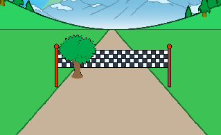

## Adding scenery

Let's code a tree to move as the player sprints.

--- task ---

First, position the tree and make it small when the flag is clicked.


```blocks3
when green flag clicked
show
go to x: (-50) y: (20)
set size to (1) %
```

--- /task ---


--- task ---

Once the race starts, the tree should move until the player has sprinted 100 meters.


```blocks3
when I receive [start v]
repeat until <(distance :: variables) = [100]>
end

```

--- /task ---

--- task ---

Once the left key has been pressed (and released), the tree should get bigger and move - just like the finish line.


```blocks3
when I receive [start v]
repeat until <(distance :: variables) = [100]>
+wait until <key (left arrow v) pressed?>
+wait until <not  <key (left arrow v) pressed?>>
+change size by (1)
+change y by (-1.5)
end
```

--- /task ---

--- task ---

If you test your tree, you'll see that it moves downwards, onto the track.



--- /task ---

--- task ---

To fix this, add code to make your tree move away from the track slightly.


```blocks3
when I receive [start v]
repeat until <(distance :: variables) = [100]>
wait until <key (left arrow v) pressed?>
wait until <not  <key (left arrow v) pressed?>>
change size by (1)
change y by (-1.5)
+change x by (-2)
end
```

--- /task ---

--- task ---

You should also do the same for the right arrow key. Here's how your Tree's code should look:


```blocks3
when green flag clicked
show
go to x: (-50) y: (20)
set size to (1) %

when I receive [start v]
repeat until <(distance :: variables) = [100]>
wait until <key (left arrow v) pressed?>
wait until <not  <key (left arrow v) pressed?>>
change size by (1)
change y by (-1.5)
change x by (-2)
wait until <key (right arrow v) pressed?>
wait until <not  <key (right arrow v) pressed?>>
change size by (1)
change y by (-1.5)
change x by (-2)
end
```

--- /task ---

