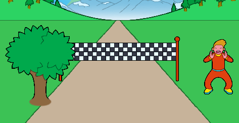

--- challenge ---

## Challenge: Add a spectator

Your project includes a couple of spectator sprites – click the ‘show’ icon for one to display it on the stage. 

Can you add a spectator to your race? Can you make the spectator cheer when you reach the finish line?



Remember that the code you'll need is very similar to the code you've already added to your finish line and your tree.

Here are some useful code blocks to help you:

```blocks3
when green flag clicked

set size to (1) %

go to x: (0) y: (0)

when I receive [start v]

repeat until <(distance :: variables) = [100]>
end

change x by (10)

change y by (10)

change size by (1)

wait until <key (left arrow v) pressed?>
```

If you prefer, you can add another tree instead, or anything else you like!


--- /challenge ---