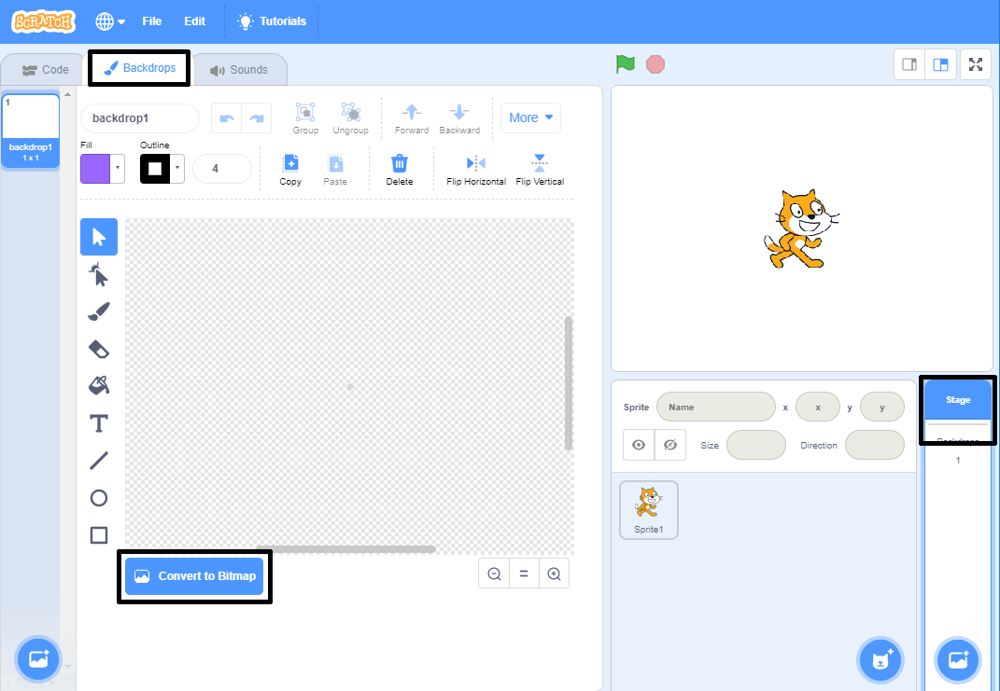
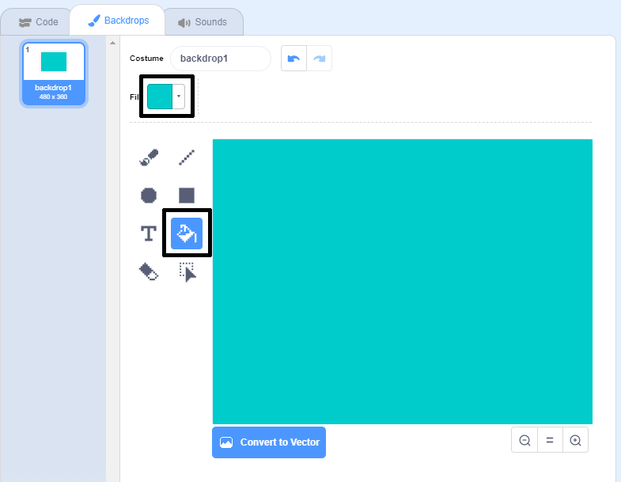
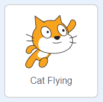

## Swimming left and right

In synchronised swimming a team of swimmers perform a coordinated routine of moves to music. 

Let's start by getting one cat swimming. 

--- task ---

Open a new Scratch project.

**Online**: open a [new online Scratch project](http://rpf.io/scratchnew){:target="_blank"}.

**Offline**: open a new project in the offline editor.

If you need to download and install the Scratch offline editor, you can find it at [rpf.io/scratchoff](http://rpf.io/scratchoff){:target="_blank"}.

--- /task ---

First let's turn the stage blue so it looks like a swimming pool. 

--- task ---

Click on the 'Stage' and then the 'Backdrops' Tab and 'Convert to Bitmap'.



--- /task ---

--- task ---

Select a blue colour and the 'Fill with color' tool and then click on the backdrop. 



--- /task ---

--- task ---

You're going to use a different cat sprite so click on the cross on the walking cat to delete it. 


--- /task ---

--- task ---

Choose the `Cat Flying` sprite from the library and add it to your project.

[[[generic-scratch3-sprite-from-library]]]



The flying cat looks like it could be swimming. 

--- /task ---

--- task ---

Now let's get the cat swimming. 

Select the 'Cat flying' sprite, click 'Code' and add the code to make the cat rotate left and right when you press the left and right arrow keys. 


```blocks3
when [left arrow v] key pressed
turn ccw (15) degrees

when [right arrow v] key pressed
turn cw (15) degrees
```

--- /task ---

--- task ---

Test your code by pressing the left and right arrow keys on the keyboard.


--- /task ---

--- task ---

And add the code for the forward and backward movement.


```blocks3
when [up arrow v] key pressed
move (10) steps

when [down arrow v] key pressed
move (-10) steps 
```

--- /task ---

--- task ---

Test your code by swimming around the stage using the arrow keys. 

--- /task ---
