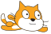

## Create the team

Synchronised swimming needs more than one cat! We can use `create clone of`{:class="block3control"} to create copies that behave in the same way. 

--- task ---

First let's add code to make sure the cat always starts in the same position when you click the green flag. 



```blocks3
when green flag clicked
go to x: (0) y: (0)
point in direction (90 v)
```

--- /task ---

--- task ---

Test your code by pressing some arrow keys and then clicking the green flag to return to the start position. 

--- /task ---

--- task ---

Now we can use a `repeat`{:class="block3control"} loop to create 6 clones (copies) of the cat. 


```blocks3
when green flag clicked
go to x: (0) y: (0)
point in direction (90 v)
+repeat (6)
create clone of (myself v)
end
```

Loops are used to do the same thing multiple times. 

--- /task ---

--- task ---

You don't want all the cats to be in the same position! 

Add code to rotate 60 degrees before creating each clone. 


```blocks3
when green flag clicked
go to x: (0) y: (0)
point in direction (90 v)
repeat (6)
+turn cw (60) degrees
create clone of (myself v)
end
```

--- /task ---

--- task ---

 Test your code by using the arrow keys. You should be able to create some amazing synchronised swimming patterns!


--- /task ---
