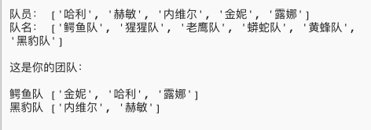

## 介紹

在這個專案中，您將學習如何從一個隊員列表中隨機地選擇隊員來建立2個團隊。

  <iframe src="https://trinket.io/embed/python/ca3af66f8d?outputOnly=true&start=result" width="600" height="500" frameborder="0" marginwidth="0" marginheight="0" allowfullscreen>
  </iframe>
  

### 俱樂部導師的附加資訊

如果您需要列印此專案，請使用[適合列印版本](https://projects.raspberrypi.org/zh-CN/projects/team-chooser/print) 。

--- collapse ---
---
title: 俱樂部導師說明
---

## 介紹：

在這個專案中，孩子們將學習如何製作一個程式，將一組隊員隨機分成2個團隊。 這個專案教授列表和使用檔案。

## 線上資源

**本專案使用Python 3。**我們建議使用[trinket](https://trinket.io/)線上編寫Python程式碼。 這個專案包含如下Trinket程式碼:

* [新建（空白）Python Trinket -- jumpto.cc/python-new](http://jumpto.cc/python-new)

還有一個包括已完成專案的Trinket：

* [完成的”組隊器“ -- trinket.io/python/a699c44ce6](https://trinket.io/python/ca3af66f8d)

## 離線資源

如果你願意，本專案可以[離線完成](https://www.codeclubprojects.org/en-GB/resources/python-working-offline/)。 你可以點選本專案的'專案資料'連結訪問專案資源。 這個連結包含一個 “專案資源” 部分，裡面有孩子們完成該專案所需的離線資源。 請確保每個孩子都可以訪問這些資源。 這部分包含如下檔案：

* team/team.py

你也可以在 “志願者資源'”部分找到該專案的完成版本，裡面包含：

* team-finished/team.py

(上述所有資源都可以以`.zip`壓縮包的形式下載。)

## 學習目標

* 列表；
* 從檔案中載入列表資料。

本專案涵蓋[樹莓派數字製作課程](http://rpf.io/curriculum)如下幾方面內容：

* [利用基本程式設計結構建立簡單程式。](https://www.raspberrypi.org/curriculum/programming/creator)

## 挑戰

* “新增更多隊員” - 向`players`列表新增更多成員。
* “為Ｂ隊選擇隊員” - 建立一個新的`teamB`列表，並向其新增隨機隊員；
* “隨機團隊名稱” - 建立和使用新的`teamNames`列表為團隊分配隨機名稱;
* “儲存團隊名稱” - 將團隊名稱儲存在檔案中，並將其載入到`teamNames`變數中；
* “更多團隊” - 將隊員分成3隊而不是2隊。

--- /collapse ---

--- collapse ---
---
title: 專案資源
---

## 專案資源

* [包含所有專案資源的.zip檔案](resources/team-chooser-project-resources.zip)
* [線上空白Python Trinket專案](http://jumpto.cc/python-new)
* [離線空白Python檔案](resources/new-new.py)

## 俱樂部導師資源

* [包含所有完成專案資源的.zip檔案](resources/team-chooser-volunteer-resources.zip)
* [線上已完成的Trinket專案](https://trinket.io/python/ca3af66f8d)
* [team-chooser-finished/team-chooser.py](resources/team-chooser-finished-team-chooser.py)

--- /collapse ---