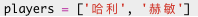
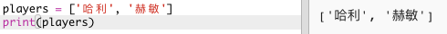
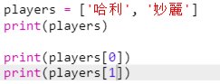

## 隊員

讓我們首先建立一個可供選擇的隊員列表。

+ 單擊連結<a href="http://jumpto.cc/python-new" target="_blank">jumpto.cc/python-new</a>，開啟一個空白的Trinket Python模版。

+ 您可以使用變數來儲存隊員**列表**， 列表應在一對方括號`[ ]`中 ，列表中的成員之間用逗號分隔。
    
    首先在你的程式中新增一個隊員列表。
    
    

+ 新增此程式碼以顯示`players`變數：
    
    

+ 您可以通過在變數名稱後面的方括號中新增其位置來獲取列表中的一個成員。
    
    列表中的第一個成員在**位置０**。 這與Scratch不同，後者是從1開始。
    
    