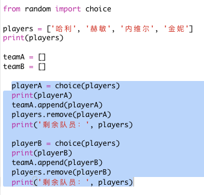
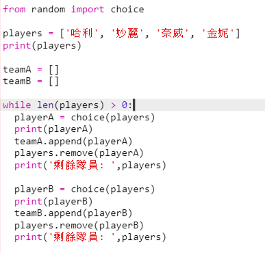
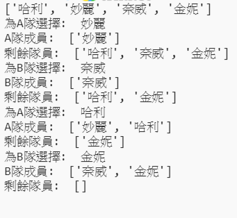
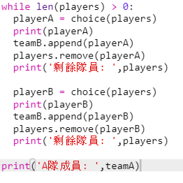
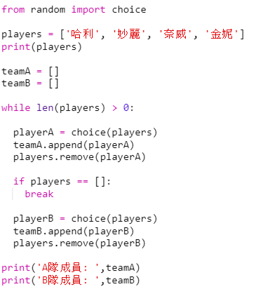
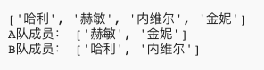

## 選擇很多隊員

接下來，你要確保每一個隊員都被選入某個隊中。

+ 突出選中為A隊和B隊選擇隊員的程式碼，然後按tab鍵縮排程式碼。
    
    

+ 新增一個**while**迴圈來繼續選擇隊員直到`players`列表的長度為0。
    
    

+ 執行你的程式碼進行測試。 你應該看到隊員們被選入A隊或B隊，直到沒有餘下隊員為止。
    
    

+ 在你的`while`迴圈**後面**新增程式碼以顯示`teamA`列表（確保它沒有縮排）。
    
    這意味著只有在所有的隊員都被選擇之後，`teamA`才被輸出一次。
    
    

+ 因為它們僅用於測試你的程式碼，因此您可以對 `teamB` 執行相同的操作，也可以刪除其他輸出命令。
    
    現在你的程式碼應如圖所示：
    
    

+ 再次測試你的程式碼，你應該只看到你的隊員名單以及最終團隊的名單。
    
    