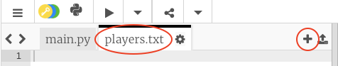
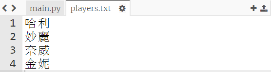
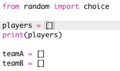
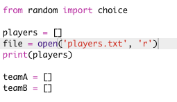
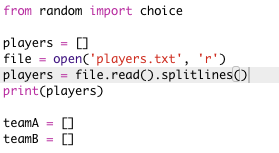

## 檔案

您可以使用檔案來儲存你的隊員名單。

+ 單擊 + 圖示並新建一個名為 `players.txt` 的新檔案。
    
    

+ 將你的隊員名單加入到新檔案中。 確保在最後一名隊員之後沒有空行。
    
    

+ 修改你的 `players` 列表, 清空。
    
    

+ 開啟你的 `players.txt` 檔案（`‘r‘` 表示只讀開啟）。
    
    

+ 從檔案中讀取列表並新增到`players`列表。 (`splitlines` 程式碼表示檔案中的每一行都是 `players` 列表中的一個新成員)。
    
    

+ 如果進行測試，您的程式碼將與此前的執行一致。 然而，現在將隊員新增到 `players.txt` 檔案的做法要容易得多。