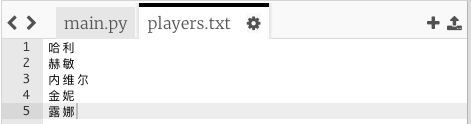
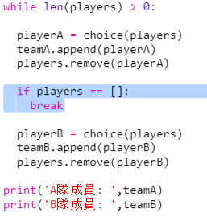

## 奇數數量的隊員

讓我們改進你的程式使它還能夠處理數量為奇數的隊員。

+ 向你的`players.txt`列表檔案中再新增一個隊員名字，這樣你就有了奇數數量的隊員。
    
    

+ 如果測試你的程式碼，你將看到一條錯誤資訊。
    
    

+ 這個錯誤是因為你的程式一直迴圈在為A隊和B隊選擇隨機隊員，如果隊員總數為奇數的話，在最後一輪中當為A隊選好隊員之後B隊就沒有隊員可以選擇了。
    
    要修復這個錯誤，你可以告訴你的程式如果`players`列表為空，則使用`break`來跳出你的`while`迴圈、
    
    

+ 當你再次測試你的程式碼，你應該看到現在它可以處理奇數數量的隊員了。
    
    