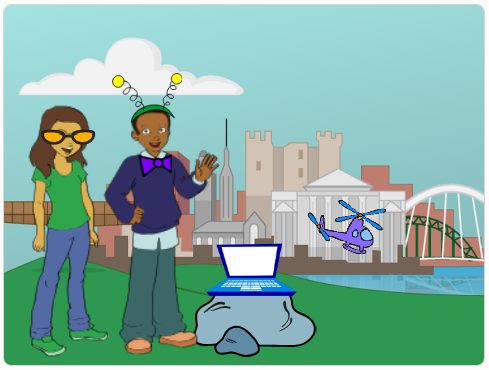

## Spinning Bow Tie

Let's code a bow tie that spins when clicked.

--- task ---

Open the Scratch starter project.

**Online**: open the [starter project](http://rpf.io/tech-toys-on){:target="_blank"}.

If you have a Scratch account you can make a copy by clicking **Remix**.

**Offline**: open the [starter project](http://rpf.io/p/en/tech-toys-go){:target="_blank"} in the offline editor.

If you need to download and install the Scratch offline editor, you can find it at [rpf.io/scratchoff](http://rpf.io/scratchoff){:target="_blank"}.

In the starter project, you should see 2 characters, a laptop and a helicopter.



--- /task ---

--- task ---

Click on the ‘Bow Tie’ sprite and add this code:


```blocks3
when this sprite clicked
repeat (10)
turn cw (15) degrees
end
```

--- /task ---


--- task ---

Click the bow tie to run your code. You should see that your bow tie turns 15 degrees clockwise 10 times, turning 150 degrees in total.


--- /task ---

--- task ---

Find the `point in direction`{:class="block3motion"} block and, _without dragging it_, click it to set the bow tie back to its starting position.

```blocks3
point in direction (90 v)
```

Tip: In Scratch you can click on a block to run it straight away. You don't even need to drag it onto the scripts area first!

--- /task ---

--- task ---

To make the bow tie do 1 complete spin, the numbers in your code need to add up to 360 degrees. Change your code so that the bow tie turns `36` degrees 10 times (36 x 10 = 360).


```blocks3
when this sprite clicked
repeat (10)
+turn cw (36) degrees
end
```

--- /task ---

--- task ---

Test your code again. This time, your bow tie should do 1 complete 360 degree spin and end up where it started.

--- /task ---

If you want your bow tie to do 4 complete spins, you can change the number in the `repeat`{:class="block3control"} block from `10` to `40`.

```blocks3
when this sprite clicked
+repeat (40)
turn cw (36) degrees
end
```
