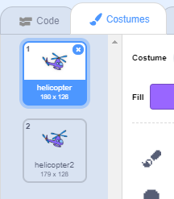

## Powering up your helicopter

Let's code your helicopter to start up when your laptop is clicked.

--- task ---

Let's start by broadcasting a `start`{:class="block3events"} message when the laptop is clicked. You'll need to create a `new message` called `start`.


```blocks3
when this sprite clicked
start sound (computer beeps1 v)
broadcast (start v)
```

This code broadcasts a message to all other sprites. If you test this code, you'll see that nothing happens yet! This is because you've not coded the helicopter to respond to the message.

--- /task ---

--- task ---

Click on your helicopter sprite and add a `When I receive`{:class="block3events"} block. Any code attached to this block will be run when it receives the 'start' message from the laptop.


```blocks3
when I receive [start v]
```

--- /task ---

--- task ---

If you click your helicopter's 'Costumes' tab, you'll notice that it has 2 costumes with slightly different propellers.



--- /task ---

--- task ---

You can use the 2 costumes to animate the helicopter. Add this code, so that the helicopter changes costumes forever once it receives the 'start' message.


```blocks3
when I receive [start v]
+forever
next costume
end
```

--- /task ---

--- task ---

Test your code by clicking your laptop sprite. Does your helicopter's propeller animate?


--- /task ---
