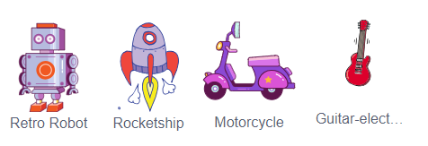

## Challenge: Create your own tech toy!
Can you create your own tech toy?

You could make the antennae move whenever they're clicked? Here's the code blocks you will need to use:


```blocks3
wait (0.1) seconds

turn cw (15) degrees

repeat (10)
end

when this sprite clicked

wait (0.1) seconds

turn ccw (15) degrees
```

You could make any tech toy you like. Here are some other sprites you could use:


