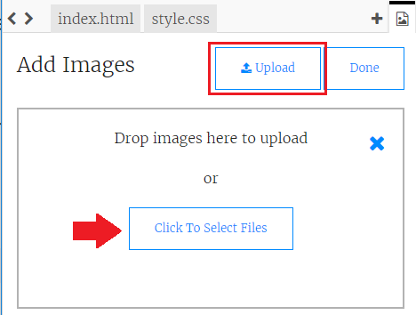

## 上传图片

**如果你有 Trinket 账户**，你还可以将你自己的图片上传至你的网页。

+ 点击 trinket 顶部的图片图标，然后点击 **Add Image**（添加图片）。


+ 点击 **Upload**（上传）按钮，然后在电脑上找到你想使用的图片，将其拖进方框中。或者使用按钮来选中它。



+ 然后只需在 `` 标记中的引号之间添加新图片的名称，如下所示：

```html

```
