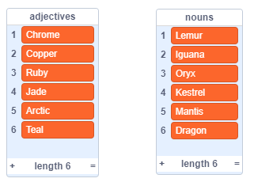
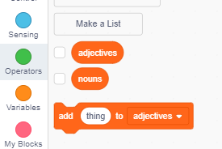
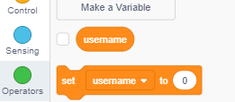
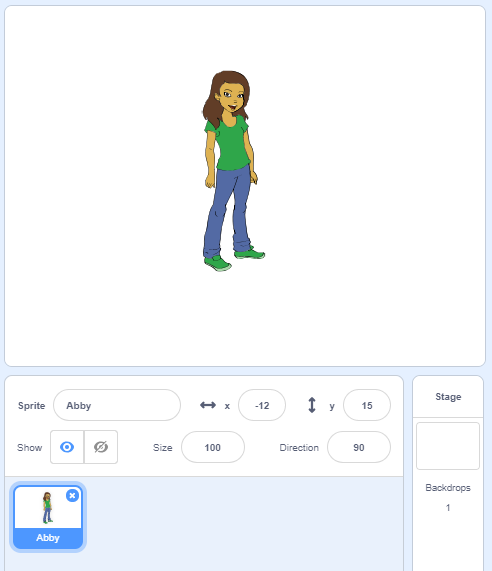
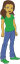
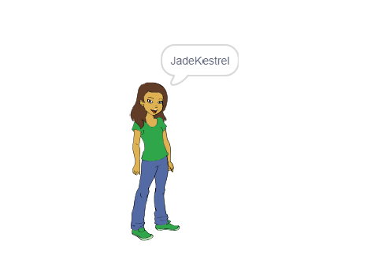

## Generating usernames

There are lots of websites and apps that use a username to identify you. This username is often visible to others. Usernames can also be called screen names, gamer tags, or handles. 

It’s important that your username isn’t your real name and also doesn’t include any personal information, such as your age, year of birth, or where you live. Other people will see your username, so make sure it’s polite, and consider what people will think about you when they read it. Remember that you might be using your username for a long time — will you still like it in three years? 

As you can see, it’s important to choose your username carefully. Let's create a Scratch project to generate 'AdjectiveNoun' usernames like 'DiamondIguana'. 

--- task ---

Open the Scratch starter project.

**Online**: open the starter project at [rpf.io/usernameon](http://rpf.io/usernameon){:target="_blank"}.

If you have a Scratch account you can make a copy by clicking **Remix**.

**Offline**: open the [starter project](http://rpf.io/p/en/username-generator-go){:target="_blank"} in the offline editor.

If you need to download and install the Scratch offline editor, you can find it at [rpf.io/scratchoff](http://rpf.io/scratchoff){:target="_blank"}.

You should see two lists on the stage — `adjectives` and `nouns`:



--- /task ---

--- task ---

Click on **Variables**, and then click the boxes next to `adjectives` and `nouns` to uncheck them and hide the lists.



--- /task ---

--- task ---

Add a variable called `username` which should be available **for all sprites**.

[[[generic-scratch3-add-variable]]]

--- /task ---

--- task ---

Click the box next to `username` to uncheck it and hide the variable from the stage.



--- /task ---

--- task ---

Add a person sprite — you can choose your favourite one. 



You can also click on **Costumes** and choose the costume you prefer.

--- /task ---

--- task ---

Add this code to your person sprite:



```blocks3
when this sprite clicked
set [username v] to []
```

--- /task ---

--- task ---

You need to combine an adjective and a noun, so add a `join`{:class="block3operators"} block inside your `set`{:class="block3variables"} block.


```blocks3
when this sprite clicked
set [username v] to (join [apple] [banana] :: +)
```

--- /task ---

--- task ---

Add an adjective in the first box in the `join`{:class="block3operators"} block.


```blocks3
when this sprite clicked
set [username v] to (join (item (1) of [adjectives v] :: +) [banana])
```

--- /task ---

--- task ---

Pick a `random`{:class="block3operators"} adjective between 1 and the `length of the adjectives list`{:class="block3variables"}


```blocks3
when this sprite clicked
set [username v] to (join (item (pick random (1) to (length of [adjectives v] :: +) :: +) of [adjectives v]) [banana])
```

--- /task ---

--- task ---

Add a random noun in the second box.


```blocks3
when this sprite clicked
set [username v] to (join (item (pick random (1) to (length of [adjectives v])) of [adjectives v]) (item (pick random (1) to (length of [nouns v] :: +) :: +) of [nouns v] :: +))
```

--- /task ---

--- task ---

Now add code blocks to get your person to say the username.


```blocks3
when this sprite clicked
set [username v] to (join (item (pick random (1) to (length of [adjectives v])) of [adjectives v]) (item (pick random (1) to (length of [nouns v])) of [nouns v]))
+ say (username :: variables)
```

--- /task ---

--- task ---

Test your code by clicking on the person sprite. You should get a new random username each time. 



--- /task ---
