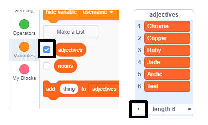

## Challenge: add more variety
Can you add more items to the lists of adjectives and nouns?

Check the boxes for the lists to show them on the stage. Then click the **+** icon and type a new word into the list. Don't forget to start each word with a capital letter. 

Real and imaginary animals and creatures work well in the `nouns` list. Try to think of unusual ones.

Here are some ideas for the `adjectives` list:

+ Metals: Zinc, Copper, Iron, Brass, Silver, Gold
+ Colours: Crimson, Aqua, Magenta, Golden, Indigo
+ Gemstones: Quartz, Emerald, Sapphire, Diamond
+ Habitats: Moon, Desert, Snow, Jungle, Forest, Space

Remember to hide the lists from the stage when testing your project.
