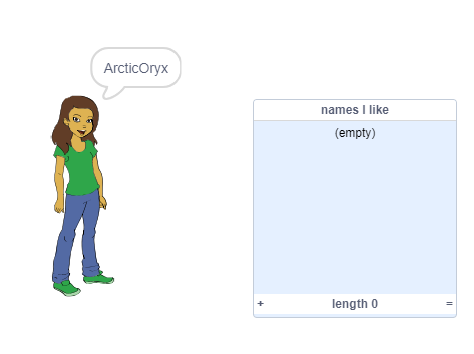
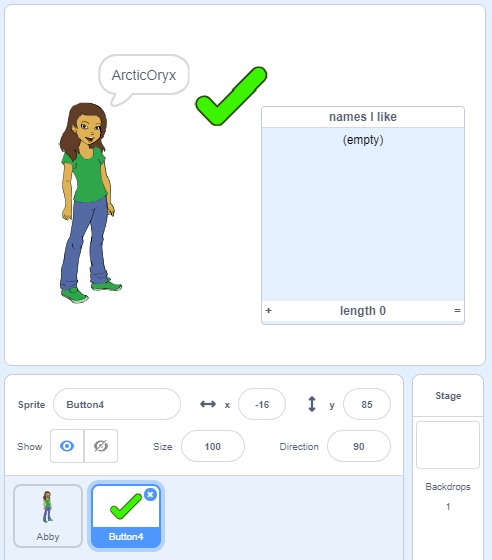
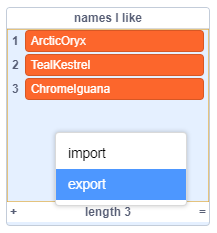

## Saving your favourite usernames

You probably want to consider a few different usernames. Let’s add usernames that you like to a list.

--- task ---

Create a new list called `names I like`:

[[[generic-scratch3-make-list]]]

--- /task ---

--- task ---

The list will appear on the stage. Drag it to the right of your person sprite and make it wider.



--- /task ---

--- task ---

Add the `Button4` sprite, which looks like <span style="color: green;">✔</span>, and drag it across the stage to the right of the speech bubble.



You may need to move the `names I like` list if the `Button4` sprite is underneath it.

--- /task ---

--- task ---

Add code to the button sprite so that when it is clicked, the current username is added to `names I like`.


```blocks3
when this sprite clicked
add (username :: variables) to [names I like v]
```

--- /task ---

--- task ---

Test your code by clicking on the person sprite until you find a username you like and then clicking the <span style="color: green;">✔</span>.


--- /task ---

--- task ---

You can export your list of usernames to a text file to save them. Right-click on the `names I like` list on the stage, click **Export**, and choose a place to save the list as a file.



You now have a text file containing a list of names that you can open with Notepad or another text editor.

--- /task ---
