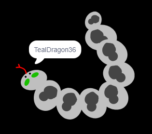

## Challenge: create your profile picture

Can you use the paint tool in Scratch to create your own profile picture to go with a username?

Here's an example:

Use a screen capture program to save your picture so that you can use it on websites or apps which show profile pictures

